# Project 1 Space Exploration

## User Story
```
As a space enthusiast I want to see cool facts about space.
I want to be able to click on different topics and learn more about them.
SO that I can plan my collonization of Mars.
I'd like to know the weather on Mars.
I want to know if any asteroids are going to hit or pass near by the pale blue dot.
```

## Project Description
* Build a responsive website where a user can get info on space related goodies.
* Live hubble telescope view.
* Near Earth objects shows us information about aseroids near us.
* Provide weather info for our explorers that travel to the red planet.
* We have a planet information tab that provides information about the planets in our solar system.
* We have a cool random quote generator about space exploration.
* Our application has information on planets in our solar system and near earth objects.
* Home page has videos from NASA and a search option.
* List of current humans on Mars ;)

## Home Page

* The home page contains top stories from NASA.
* We have a search bar in the home page as well.

## Nasa Photos

* Astronomy Picture of the Day gives the cool picture of space when the user provides the particular date.

## Live Hubble View

* Live Hubble Telescope view shows us what Hubble is currently looking at
* We also have a description of what is currently being displayed on the screen

## Near Earth Objects

* Near Earth objects tells us which asteroids are near us and names them
* Provides information on size of the object
* It provides the distance from Earth
* Tells us if the asteroid will hit our beautiful planet

## Mars Weather

* Embeded the current Mars weather from https://mars.nasa.gov/insight/weather/
* Added the API for Mars weather
* Current list of humans on Mars ;)

## Planet Information

* Provides information on the planets in our solar system
* It auto loads information on the planet Mercury upon clicking the tab "Planet Information"

## Quote Generator

* Added a button in the quote generator tab which providees cool quotes and facts about space

## Helpful Links

* https://rapidapi.com/blog/nasa-api-profile-explore-the-cosmos-with-code/amp/
* https://api.nasa.gov/
* https://api.nasa.gov/insight_weather/?api_key=unepUpoJglDuNOxtOuPToAdKApZ40RRSvfwIHto6&feedtype=json&ver=1.0

## Challenges Faced

* Always API call resulted in CORS error. 
* To make video more responsive and appealing for the eyes.
* While implementing Search engine for homepage.
* Extracting required contents from the response especially while making two api calls for the same.
* Overcome all the challenges faced by knowledge sharing and also by researching online with some serious Google Fu.


## Technologies Used
* Technologies used: HTML, CSS, Materialize CSS, Javascript, JQuery. Used Nasa and Wikipedia APIs (and Moment.js) for getting the relevant information.

APIs Used:
1. https://images-api.nasa.gov/search?q=Nasa Space Mission&media_type=video
2. http://hubblesite.org/api/v3/external_feed/st_live?sort=-pub_date
3. https://api.nasa.gov/neo/rest/v1/feed?start_date=STARTDATE&end_date=ENDDATE&api_key=YOUR_API_KEY
4. https://api.nasa.gov/planetary/apod?api_key=YOUR_API_KEY&date=DATE
5. http://en.wikipedia.org/w/api.php?format=json&exintro=True&action=query&titles=MERCURY&prop=extracts&explaintext=True

Library:
Moment.js- Date : [Moment.js](https://momentjs.com/)

## Links

* https://jordanrbunnell.github.io/spaceexploration/
* https://github.com/jordanrbunnell/spaceexploration


## Screenshots

<p style ="text-align:center;">
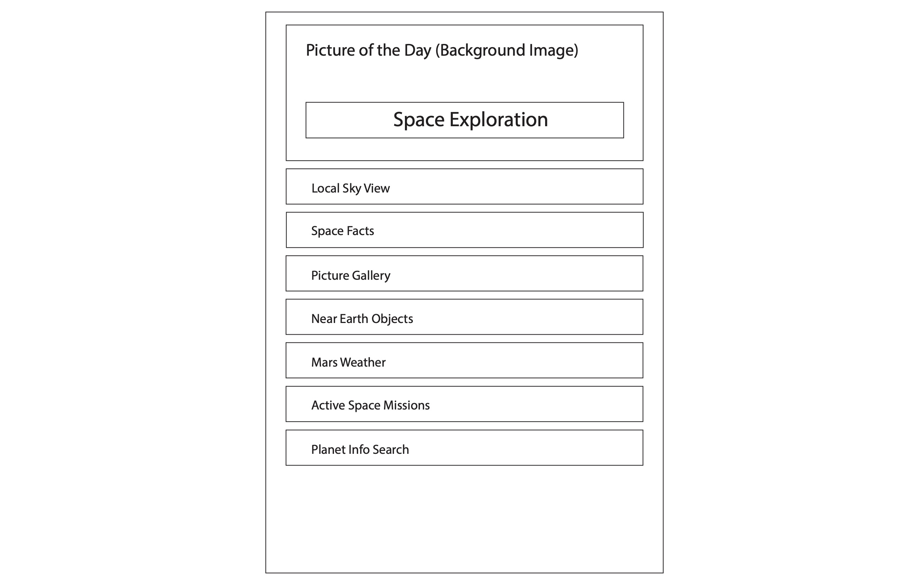
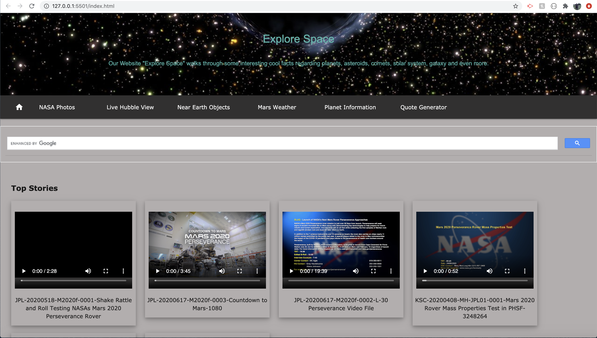
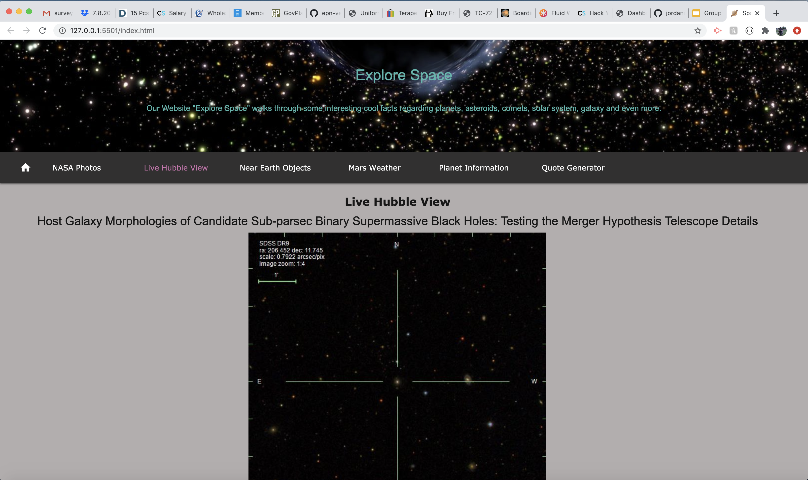

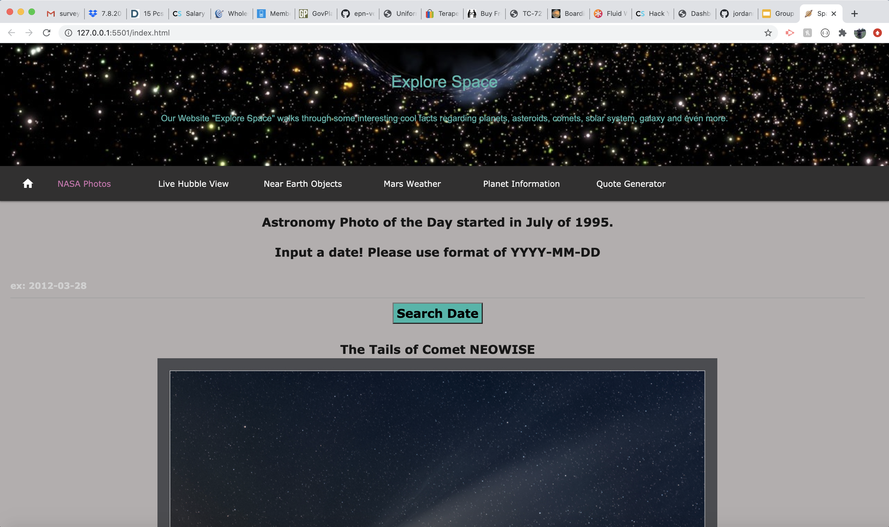
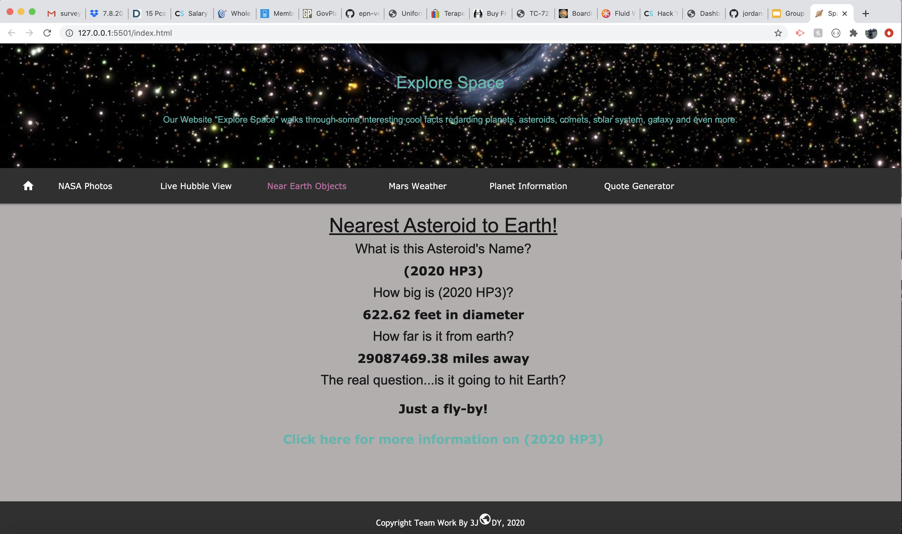
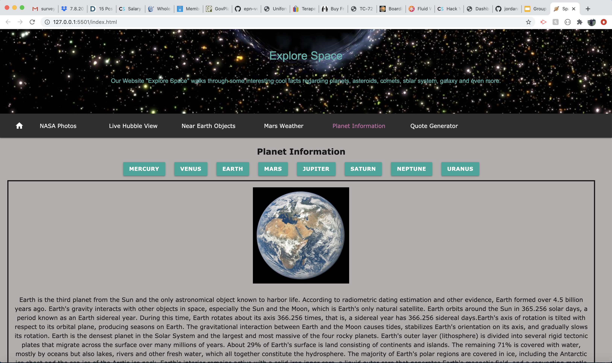
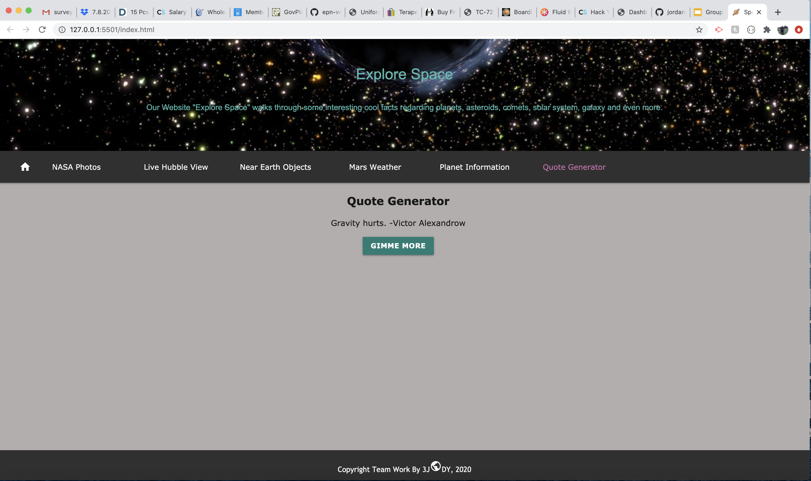
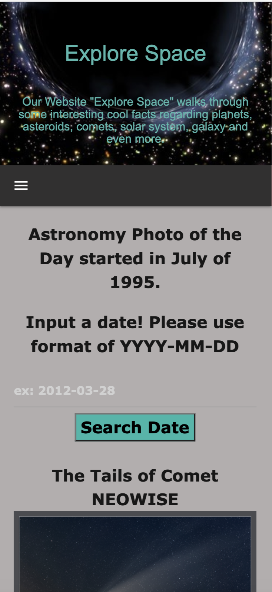
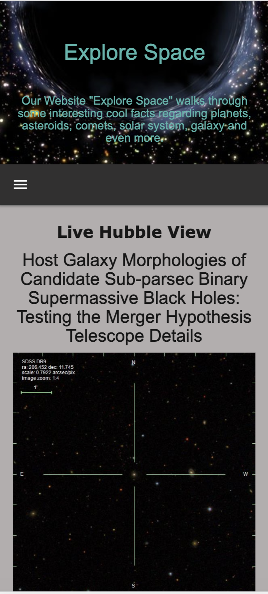
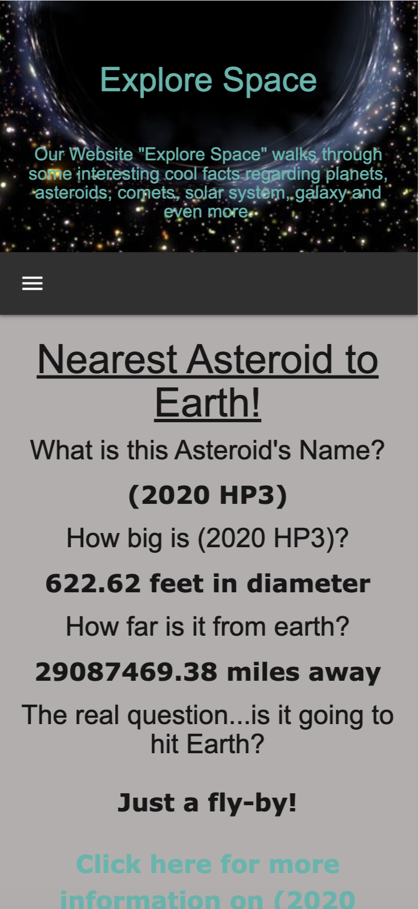
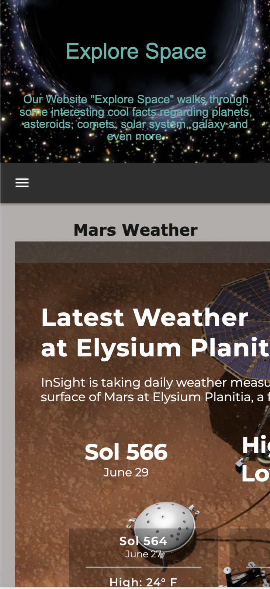
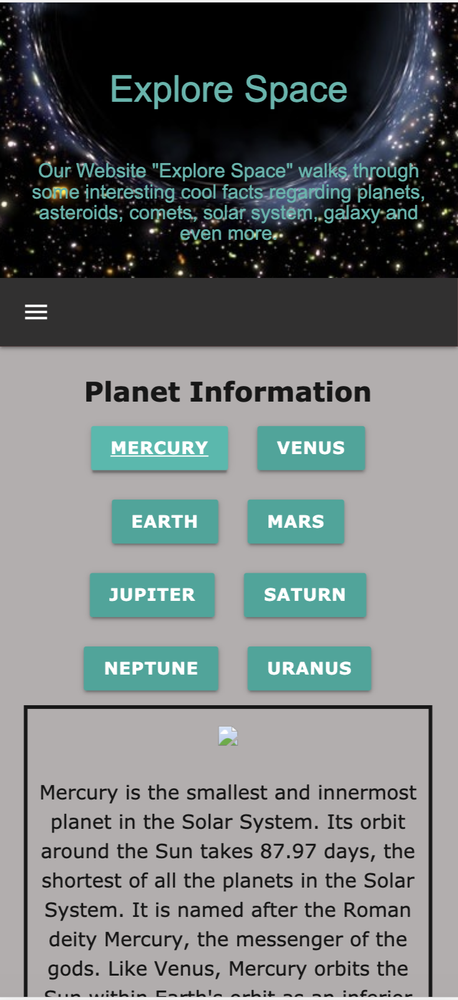
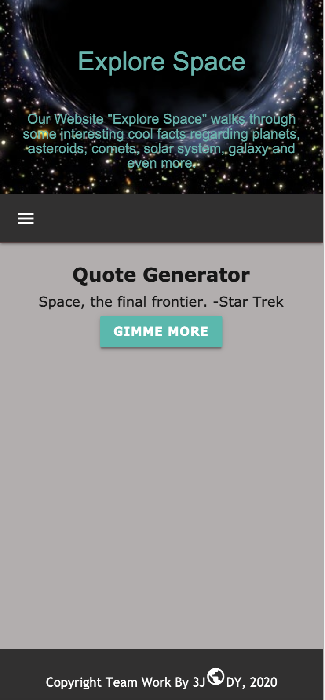
</p>

### References 

Blog On CORSError : [CORSError](https://medium.com/@dtkatz/3-ways-to-fix-the-cors-error-and-how-access-control-allow-origin-works-d97d55946d9)<br/>
Video On NasaAPI : [NasaAPIVideo](https://www.youtube.com/watch?v=FBTlPriUyWY )<br/>
StackOverflow : [StackOverflow -To highlight the tabs](https://stackoverflow.com/questions/26512658/how-to-highlight-the-selected-tab)<br/>
W3Schools : [W3Schools-Jquery](https://www.w3schools.com/jquery)<br/>
Materialize : [Materialize Documentation](https://materializecss.com/)<br/>
Video On Footer : [Footer Video](https://www.youtube.com/watch?v=US_3XvufMLU)<br/>
MediaQueries on JS File : [MediaQueries - JS](https://www.sitepoint.com/javascript-media-queries/)