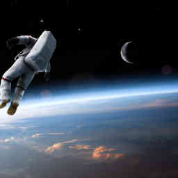

# Project 1 Space Exploration

## User Story
```
As a space enthusiast I want to see cool facts about space
I want to be able to click on different topics and learn more about them
SO that I can plan my collonization of Mars.
```

## Project description
* Build a responsive website where a user can get info on space related goodies
* Provide weather info for our intergalactic explorers
* It has a picture of the day that updates every day with cool space pictures. Home page profile picture, clicking the picture of the day will take you to a page of random space pictures.
* Has information on asteroids, planets and moons 
* Depending on latitude and longitude we can pull details and picture on that particular location
* Local sky view that tells us about aseroids near us. 
* Our website shows us current space missions on the ISS

* https://rapidapi.com/blog/nasa-api-profile-explore-the-cosmos-with-code/amp/
* https://api.nasa.gov/

